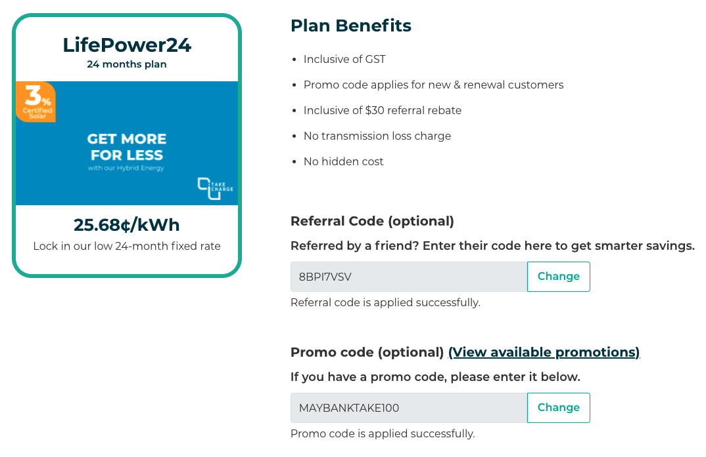

As electricity retailers are shutting due to recent surge of natrual gas prices, many of us are forced to decide what's the next move. I kind of regretted not renewing my contract earlier in Feb, and switched over to SP wholesale, but it no longer looks sustainable starting this month. I believe prices will still continue to go up in the next few months.

After lots of deliberation and research over the past few weeks, I've decided to go for a fixed plan with Senoko, as it seems like they were offering the lowest fixed rates of 22c/kWh from my research amongst the other players (I believe it has also gone up to 25.68c/kWh per time of writing).

# Why Senoko for me

Senoko was also giving substantial sign up and stackable promotions, which I thought could potentially offset this price hikes.

Furthermore, they have no transmission loss charge, and no hidden costs which appeals to me. Previously when I was on other providers, I had to pay additional fees such as vesting contract charges, market support service charges etc, which adds up significantly.

# Additional $10 rebate offer

If you're like me who decided to sign up for Senoko, I'd like to offer you my **referral code: 8BPI7VSV**.

On top of the $30 new sign up rebate offered by Senoko, I'll also share a portion of the rebate and send you **an additional $10 from me**, for your (assuming successful) new sign up with my referral code.

Be sure to also stack this with the [available promotions](https://www.senokoenergy.com/households/promotions). For example, if you have Maybank card, you can potentially take an additional $100 off (while promotions last).

If you have used my **referral code: 8BPI7VSV** and successfully signed up, please fill in [this form - http://bit.ly/senoko-tenmore](http://bit.ly/senoko-tenmore).

So with a 2-year plan, you could potentially get up to $100 (credit card promo), + $30 (referral rebate from senoko) + $10 (referral rebate from me)!

