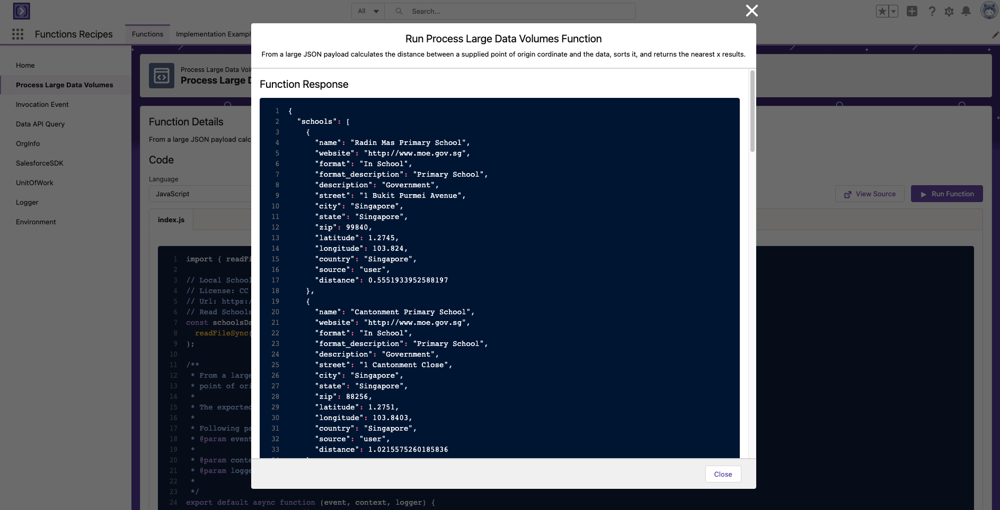
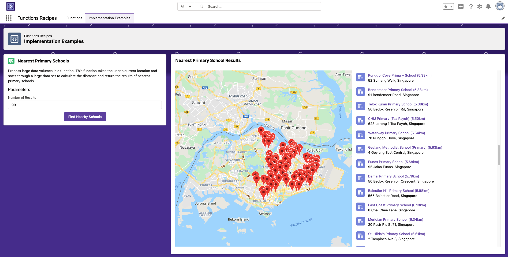

Yay! [Salesforce Functions](https://developer.salesforce.com/docs/platform/functions/overview) has just been launched General Availabile (GA) on 12 Oct 2021, and here's a my 2 cents on what I've learnt about it!

## What is Serverless

Serverless computing has been a pretty interesting concept in the past few years. Contrary to the literal meaning of its name, 'Serverless' doesn't mean there are no servers involved, but rather developers no longer have to worry about servers or infrastructure requirements. This allows them to focus their efforts on the code/task itself, as the serverless environment abstracts away infrastructure into a solid Application Development ecosystem/platform.

Functions are essentially modularized code/programs that does small bite-size tasks, and are usually used in a larger application that invokes/calls functions to do complex tasks. We can perhaps think of functions as pieces of lego building blocks to build a larger application.

With the concept of serverless, developers can develop code and execute functions to perform tasks on demand, and not have to worry too much about the underlying compute infrastructure. This is also probably better described as Functions-as-a-service (FaaS).

The serverless concept has the potential to revolutionize the way developers write, deploy and execute code, which can now respond to requests and process data based on events and triggers.

## Salesforce Functions

Salesforce Functions is a new elastic service on the Salesforce platform that enables this: businesses to deliver more scalable experiences and serverless applications on Salesforce, by extending the data and workflows that they already have, making them more robust with the power of elastic compute and open language flexibility, such as JavaScript or Java.

Developers can write code that inplements business logics that can then be assembled as building blocks in flow or integrated LWC. All developers need to do is:

1. Enable functions as a feature in the organization
2. Create a function in the project that will be integrated with the application

This is super exciting, as developers can run non Apex code in the Salesforce universe (hence staying within the Salesforce trust boundaries for compliance), and do all sorts of amazing stuff such as creating data model against Salesforce data, processing large data volumes etc.

Also, with Salesforce Functions, customers now can push past previously [org governor limits](https://developer.salesforce.com/docs/atlas.en-us.salesforce_app_limits_cheatsheet.meta/salesforce_app_limits_cheatsheet/salesforce_app_limits_platform_apexgov.htm) presented with Apex.

# Function Recipes Demo

I had the opportunity to play around with one of the [sample demo code here on Github](https://github.com/trailheadapps/functions-recipes). In there, one of the sample code which was super cool was the ability to run functions (using either JavaScript or Java) which looks through a [large dataset of schools](https://code.org/learn/find-school/json), and finds the nearest top x schools taking reference to my location.

I made a little tweak and replaced the dataset with the list of Singapore's primary schools, and I was able to easily find the nearest primary schools from my current location! This could be super useful for parents who are trying to find the nearest primary schools from their homes for Primary 1 registration exercises!

By invoking the function, it returns the list in a JSON response, or I could easily have this plotted out on a map! Pretty cool!

## Use Cases

With Salesforce Functions, it now opens up a wide range of opportunities to deliver new experiences! I can imagine lots of developers and customers leveraging it for some of these use cases on the Salesforce platforms:

- Image resizing and standardizing before saving using 3rd party libraries
- Ease burden on complex and CPU intensive calculations and triggers to perform (asynchronous) bulk processing, especially on Salesforce data (i.e. calculate most efficient delivery routes)
- Machine learning related-work, creating models and training using Salesforce data
- Data validation and processing

## Summary

In summary, here's why developers would love Salesforce Functions:

- More computational power
- Scalability to meet computational demands
- Works seamlessly with Salesforce platform and data, integrated with and accessible from within Salesforce low-code & pro-code tools
- Supports open languages and frameworks like Java and JavaScript where developers are familiar with, including 3rd party libraries

If you'd like to find out more, be sure to check out these resources:

- [Salesforce Functions Developer Docs](https://developer.salesforce.com/docs/platform/functions/overview)
- [Salesforce Functions Recipes on Github](https://github.com/trailheadapps/functions-recipes)
