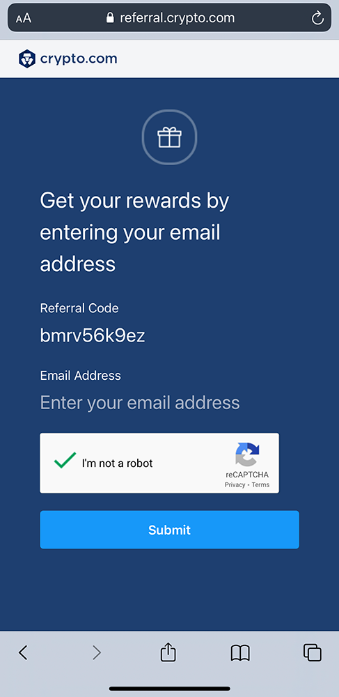
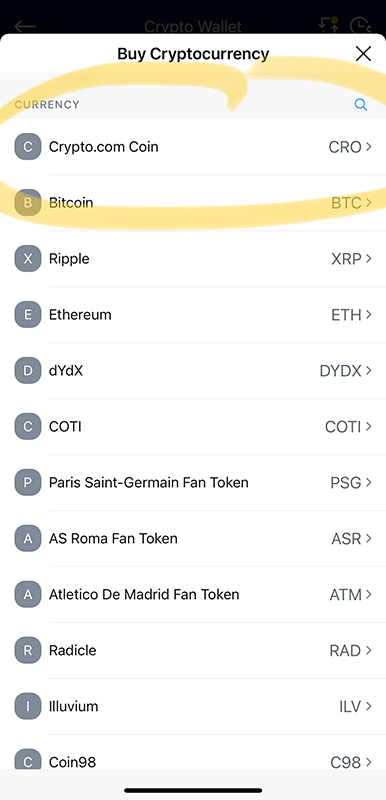
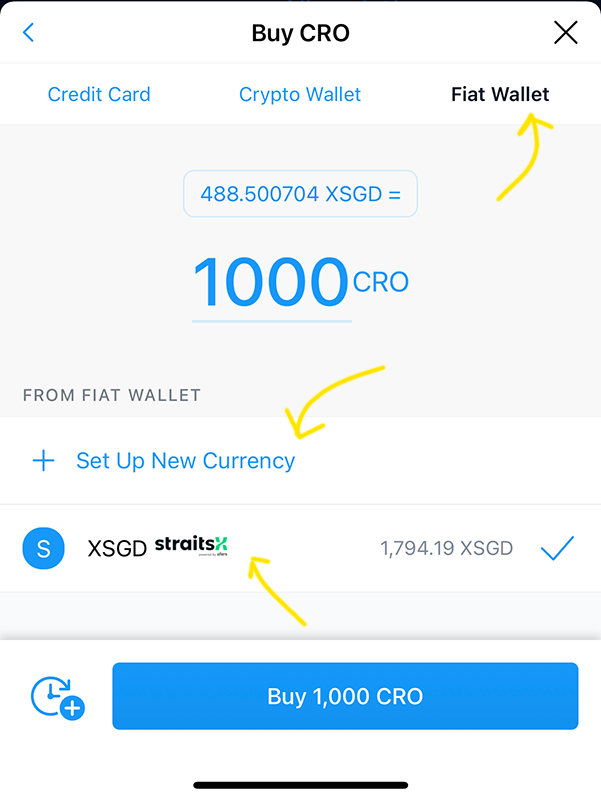
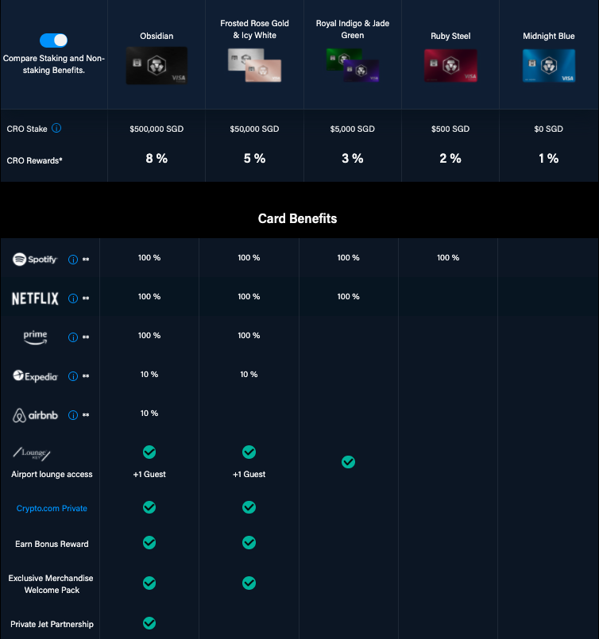
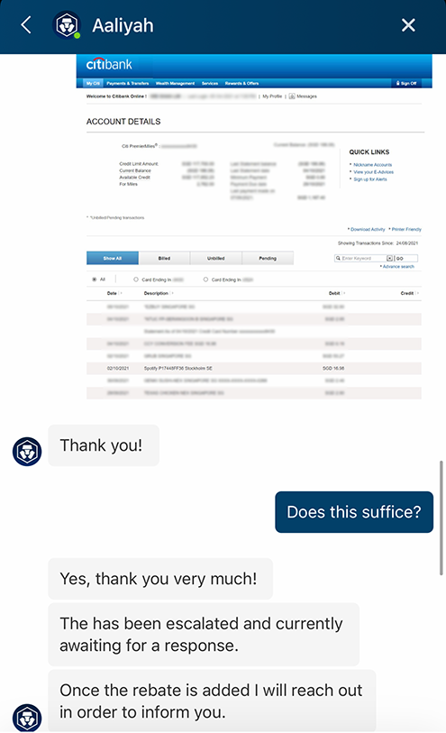
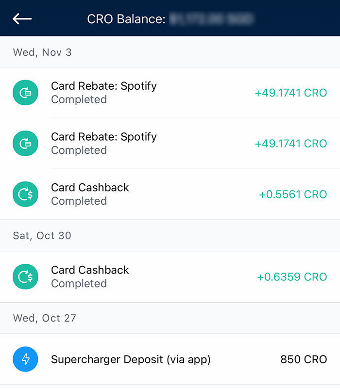
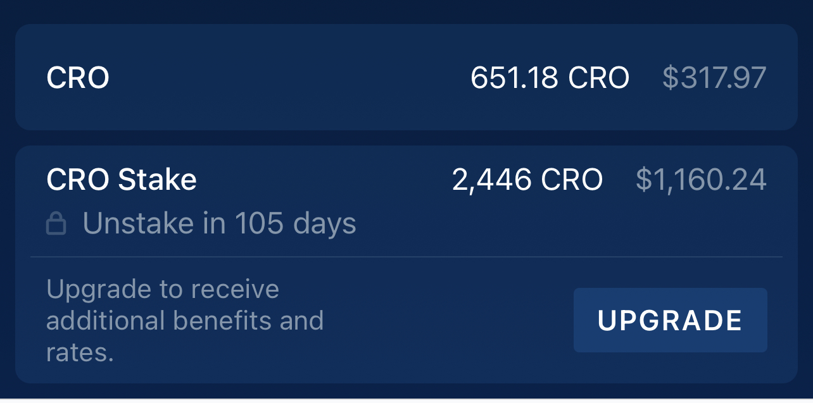

Lots of hype on crypto currencies recently as Bitcoin (BTC) and Ethereum (ETH) surge once again past all time high! Thanks to my very smart friends in the crypto space, I've started to research more and truly believe that there's huge potential behind this new paradigm.

With the world shifting towards more digital, coupled with the disadvantages of fiat currencies, there's a lot of exciting use-cases with digital currencies for the future. While in its infancy stage, no doubt there's still going to be lots of speculations and volatility, so please do your own research before getting into cryptos. Nevertheless, if you have some small change that you can afford to lose, perhaps you may even consider this is a potential high-risk, high-reward investment :)

If you're keen to get started or are new to crypto, I'd recommend for you to get some free crypto from Crypto.com - while the promotion lasts! Here's a little sharing of it from my own experience.

**_Disclaimer_**: This post reflects solely my opinion, be sure to **do your own research (DYOR)** before making any investments, especially in the crypto space! I'd like to make a disclaimer that **this is not financial advice :)**

 

## Crypto.com 'free' Spotify, Netflix, Amazon Prime and more!

Crypto.com provides lots of rewards and benefits (such as '[free](#free)' Spotify) if you sign up with them and apply for one of its Visa card!

In a nutshell, here's what you need to do:

1. Sign up for a Crypto.com account using [this link](https://crypto.com/app/bmrv56k9ez) and referral code **bmrv56k9ez**.

2. Complete KYC

3. Sign up for Visa card (at least Ruby Steel tier) with a stake of SG$500

4. Prove to customer support your subscriptions

5. Collect your 'free' monthly rebates :)

 

## Instructions in more detail and depth

#### 1. Sign up for a Crypto.com account

Sign up using this link (https://crypto.com/app/bmrv56k9ez) and my referral code **bmrv56k9ez**. This will give you **USD$25** in CRO once you're successful in opening the account and staking for the Visa card. (See [What is CRO](#whatiscro) & [Referral Program](https://help.crypto.com/en/articles/3124990-bg25-referral-program))

 

#### 2. Complete your KYC process

KYC stands for know-your-customer, where you'd be asked to submit a photo of your ID. This is pretty much standard practice for identity verification (to prevent fraud).

 

#### 3. Sign up for the Ruby Steel Privileges (or higher tier) Visa card.

Note that you'll need to buy and [stake](https://help.crypto.com/en/articles/1961286-how-do-i-stake-cro-on-the-crypto-com-app) SGD$500 worth of CRO for 180 days to get the Ruby Steel Visa card, so as to get the Spotify rebate benefits.

If it's your first time buying CRO, perhaps the easiest way to do that is to go to the _Crypto.com App main menu -> Buy -> Crypto.com coin_.

 

You can select either **Credit Card** or **Fiat Wallet** to buy CRO.

If you choose the **Fiat Wallet** option, you'll need to **Set up a new Currency** using [StraitsX](https://www.straitsx.com/) (powered by Xfers) to transfer SGD into the account. You'll need to open a StraitsX account if you do not have one. This is my preferred method as it is similar to a bank transfer process.

If you're using the **Credit Card** option, note that while Crypto.com charges [0% fees for first 30 days](https://blog.crypto.com/0-credit-debit-card-fees-for-the-first-30-days/), you _may_ however still incur fees from the bank due to cash advance or dynamic currency conversion fees, so be sure to check with your bank if these charges apply!

Once you transfer SGD into StraitsX and linked it with your Crypto.com account, you'll then receive XSGD in your Crypto.com account. XSGD is a Singapore-dollar-pegged stablecoin (i.e. 1XSGD ~= 1 SGD); you can think of it as SGD in the crypto world, which you can use to make transactions in crypto platforms like Crypto.com.

Once you have transferred in XSGD and made the purchase for SGD$500 worth of CRO, **be sure to stake the SGD$500 worth of CRO for the Ruby Steel Visa card!**

If you're new to the concept of [staking in Crypto.com](https://help.crypto.com/en/articles/1961286-how-do-i-stake-cro-on-the-crypto-com-app), you can think of it like a fixed deposit, where you need to buy and hold the CRO tokens in your Crypto.com wallet for a period of 6 months (no selling or withdrawing allowed). The SGD$500 will be subjected to the fluctuations of the value of the CRO tokens during the 6 months (with potential upside if CRO moons)!

**Note:** Alternatively, apart from the Ruby Steel card, you can also choose the higher tier cards for more benefits (but you would need to stake more CRO). For example, if you stake SGD$5,000 for the Jade Green/Royal Indigo, you'll get 'free' Spotify + Netflix, as well as Airport Lounge access! However, for maximum ROI, I believe the Ruby Steel card is the best per my [summary](#summary) below.

[More info here on different Visa card options](https://crypto.com/sg/cards):

 

#### 4. Prove to customer support your subscription(s)

Although Crypto.com stated that you will need to [pay for the recurring subscription using their Crypto.com Visa card to get the subscription rebates](https://help.crypto.com/en/articles/3477409-purchase-rebates), I have used my own personal Citibank Visa card to pay for Spotify and it seems to be acceptable too.

If you're paying using your own credit card, you'll need to inform customer support. Within the Crypto.com app, you can easily chat with Crypto.com's customer support (which is super responsive) and show proof of subscription charges for Spotify. I haven't tried for Netflix or Amazon Prime since I don't qualify with the Ruby Steel card, but I believe the process may be the same too, if you choose the higher tier cards.

From the app's Main menu, click on the chat logo on the top right, and select:

_Send us a message_ -> _English_ -> _Crypto.com Visa Card -> CRO Rewards Programme -> No_

Tell the agent you want to receive the Spotify Visa card rebates. They will ask you for proof of payment of the subscription with your name, which I sent a bank statement as follows. Thankfully they only asked this once and not every month! :) Here's a screenshot of my chat with an agent (I blurred out confidential info here).

 

#### 5. Collect your 'free' monthly rebates

Receive monthly cashback/rebates for your Spotify subscription (or Netflix, Amazon Prime etc. if you qualify)! The reason why I'm saying _'free'_ is because you will receive the subscription rebates in the form of Crypto.com's native token, CRO, which you see in the screenshot here.

One thing you may want to note is that Crypto.com is [launching these offers independently](https://help.crypto.com/en/articles/3477409-purchase-rebates) and there is no partnership between Crypto.com and the merchants in the offer, and they have the rights to modify the offer at any time. But hey - free is still free while it lasts :)

 

## What is CRO and what can you do with it? 

During the time of writing this blog post, one CRO token is worth ~SGD$0.50. It has gone up almost 2x since i staked my SGD$500 for the Ruby Steel card, which is now worth >SGD$1,000. This made me regret a little not staking more for the higher tier cards :p

Please do understand that CRO's value (like any crypto coins today) can be very volatile! Hopefully in another 105 days time when I unstake, my SGD$500 staked CRO will be worth SGD$5,000 and I can automatically qualify for the Royal Indigo & Jade Green cards :D

In any case, with CRO tokens, you can sell any CRO (that is not staked/locked) back to fiat (i.e. USD, SGD etc.), or you can use it to buy other cryptos, such as the popular Bitcoin (BTC), Ethereum (ETH), as well as many other coins on the Crypto.com platform! You can also transfer CRO to other trading platforms which supports the buying of other coins which may not be available on the Crypto.com platform.

If you have spare CRO, you can also deposit them into the Supercharger pool to earn rewards on other tokens as well! Good way to farm additional crypto for free!

 

## What about the Crypto.com Visa card?

You might ask - should I use the Crypto.com Visa card? Well, it's really optional, in my opinion.

It's a nice metal card to have which charges no annual fees. Since I'm a miles card person over cashback cards, I don't use it much, but should you choose to use the card for your purchases, you get rebates in the form of CRO depending on the tier of the card.

For example, the Ruby Steel card (which you would have staked SGD$500 for) provides a 2% rebate on qualifying spends. Note that the Visa card is a debit card, and you'll need to top up with SGD credits before you can use it to spend! See exclusions/restrictions of CRO rewards programme [here](https://help.crypto.com/en/articles/4597450-restriction-of-cro-rewards-program).

In case you missed it earlier, this screenshot shows an example of how the Card Cashbacks get credited in CRO:

 

## Summary - why is this attractive

In summary, this is pretty awesome because by only **staking SGD$500** for the Ruby Steel card, and getting **in return USD$12.99 (~SGD$18) every month** brings me a pretty **good ROI (almost 43% returns a year)** - assuming Crypto.com does not end or change the promotions.

Also, this is not yet **factoring in the USD$25 (SGD$34) from the referral sign up bonus** you get, which is already **7% ROI** in addition. Plus, there's still room for potential upside if the value of CRO goes up (like mine doubled!)

On the flipside, the risk is that should CRO go down in value, you may lose part of your SGD$500, or worse if it goes to 0 and you lose your full deposit of SGD$500.

In any case, I see more upside than downside in CRO! Crypto.com has been recently launching lots of campaigns such as [Missions Campaigns](https://blog.crypto.com/crypto-com-app-missions/) to promote more trades on their platform, which in my opinion is a good sign for CRO.

I hope this helps you kick start on your crypto journey! And thanks to many from the Seedly Facebook group for all your feedback on this post! :)
