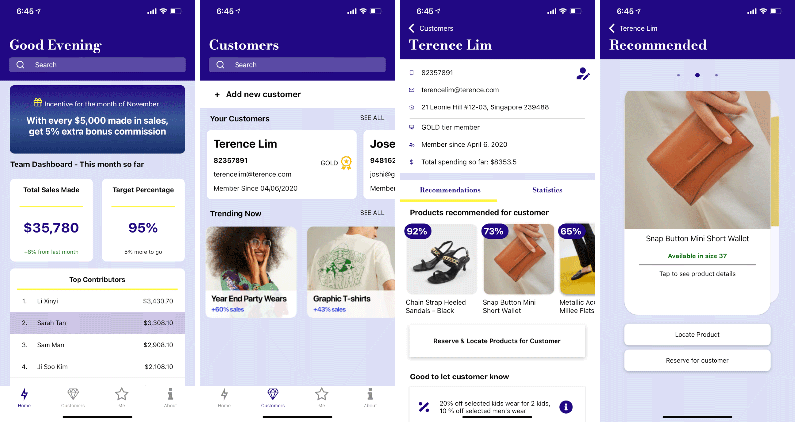
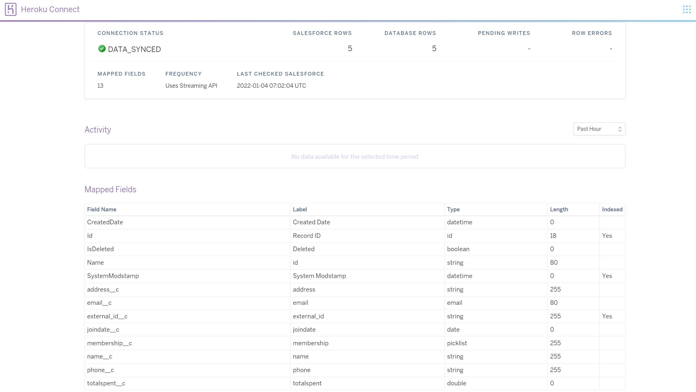
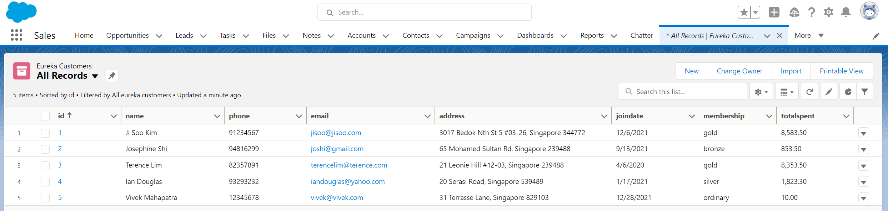
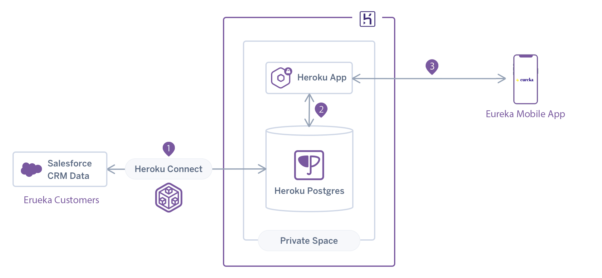

With the rise in modern app development and an increased demand by customers for native ways to allow developers to extend and customize the apps they’re building, I'm sharing this post to discuss how I have developed a [React Native](https://reactnative.dev/) + [Expo](https://expo.dev/) mobile app using open source tools, while easily extending a set of architecture solution pattern that expands the power of Salesforce Platform and data to developers.

<br />

## The React Native Mobile Clienteling App

This mobile app demo aims to showcase a simple retail (Eureka) clienteling use-case, where in-store associates are empowered to identify their most loyal customers and their preferences, so as to provide a more targeted service to improve sales.

In this demo app, some clienteling features include the Home Screen which features a sample dashboard performance of the store and associates, a Me - Profile Screen centered around the associate's performance with the business and most importantly - a Customers Screen for associates to see details of their loyal customers.



In this blog, I'll focus more on how to interact with Salesforce via the mobile app.

For interested developers, the full source code of the React Native sample mobile app is available on Github:

[https://github.com/terlim-sfdc/eureka](https://github.com/terlim-sfdc/eureka)

<br />

## Connecting to Salesforce CRM Data - Heroku Connect

In order for the Eureka Mobile App to interact with Salesforce CRM Data, I used [Heroku Connect](https://www.heroku.com/connect), which is an amazing add-on that easily synchronizes data between a Salesforce organization and a Heroku Postgres database. As you see in the screenshot below, I was able to easily create a mapping of the fields and records of the Eureka Customers object to a table in Postgres with just clicks!





<br />

## The API interface layer on Heroku

Once the mapping of the Salesforce CRM is completed and replicated on a Postgres database in Heroku, the next step involves creating an API interface layer to handle the API requests from the app. I used [ExpressJS](https://expressjs.com/) to create this middleware layer to be utilized by the mobile app (and in fact any other apps). This is actually a very simple web app hosted on Heroku, and I can easily query for the list of all the customer's data as follows using the HTTP GET method:

```javascript
app.get('/customers', (req, res) => {
  client.query('SELECT * FROM salesforce.eureka_customers__c;', (err, result) => {
    if (err) throw err;
    for (let row of result.rows) {
      console.log(JSON.stringify(row));
    }
    res.send(result.rows);
  });
});
```

Alternatively, I can also use routes in my paths to easily query for each customer using their Customer ID, which is very useful within the Customer Details Screen:

```javascript
app.get('/customers/:userId', (req, res) => {
  const userId = req.params.userId;
  client.query(
    'SELECT * FROM salesforce.eureka_customers__c WHERE id = $1;',
    [userId],
    (err, result) => {
      if (err) throw err;
      for (let row of result.rows) {
        console.log(JSON.stringify(row));
      }
      res.send(result.rows);
    }
  );
});
```

Finally, to allow my mobile app to modify existing data using the HTTP POST method, the following simple sample code allows me to update the Postgres database via an API call, and Heroku Connect magically synchronizes the Eureka Customer Object in Salesforce.

```javascript
app.post('/customers', (req, res) => {
  const { id, name, email, address, phone } = req.body;
  client.query(
    'UPDATE salesforce.eureka_customers__c SET name__c = $2, email__c = $3, address__c = $4, phone__c = $5 WHERE id = $1;',
    [id, name, email, address, phone],
    (err, result) => {
      if (err) throw err;
      for (let row of result.rows) {
        console.log(JSON.stringify(row));
      }
      res.send(`User modified with ID: ${id}`);
    }
  );
});
```

View the full source code of the API interface app on Github:

[https://github.com/terlim-sfdc/eureka-server/blob/master/app.js](https://github.com/terlim-sfdc/eureka-server/blob/master/app.js).

<br />

## Accessing the Salesforce/Postgres Customers Data from the Mobile App

Within the React Native Mobile App, Axios Javascript library is used to make the necessary HTTP requests and API calls to the API interface layer app. This a sample Javascript code which I used for querying the database content. Of course, this API can be called with any application that supports HTTP requests. To explain briefly on this sample code below, there is an asynchronous call using Axios to retrieve the customer list from the Postgres database, and _setCustomers_ is used to update the state of the customers data object in the app.

```javascript
// Fetch Customers from Database
const url = `https://eureka-mobile-demo.herokuapp.com/customers`;
const fetchCustomers = async () => {
  try {
    setIsLoading(true);
    const response = await axios.get(url);
    if (response.status === 200) {
      setCustomers(response.data);
      setIsLoading(false);
      return;
    } else {
      throw new Error('Failed to fetch customers from data');
    }
  } catch (error) {
    if (axios.isCancel(error)) {
      console.log('Customer Data fetching cancelled');
    } else {
      console.log(error);
      setIsLoading(false);
    }
  }
};
```

Having implemented the feature to query the API via a GET method above, we should expect to also be able to call the POST method to modify the content of the Postgres database, and eventually also update the Eureka Customer Custom object within the Salesforce tenant/organization through Heroku Connect.

This is a sample code of how the Update Customer Details Screen is implemented by calling the _handleSubmit_ method when the Customer Details Update form is submitted within the app, which sends the updated _customerDataObject_ from the state of the app to the Heroku ExpressJS App.

In a typical production implementation, it would definitely be good practice to implement a security feature to ensure the right authentication exists in the header of this POST request, to allow only authenticated apps to make changes to the Postgres database and the Salesforce organization. For the purpose of this demo, this security feature wasn't implemented.

```javascript
const baseURL = `https://eureka-mobile-demo.herokuapp.com/customers`;
const handleSubmit = () => {
  var data = qs.stringify(customerDataObject);
  var config = {
    method: 'post',
    url: baseURL,
    headers: {
      'Content-Type': 'application/x-www-form-urlencoded'
    },
    data: data
  };

  axios(config)
    .then(function (response) {
      console.log(JSON.stringify(response.data));
    })
    .catch(function (error) {
      console.log(error);
    });
  Alert.alert('Customer details updated!');
};
```

Once again, you may check out the full source code of the React Native sample mobile app on Github:

[https://github.com/terlim-sfdc/eureka](https://github.com/terlim-sfdc/eureka)

## Architecture

In a high level, this is what the architecture looks like.

1. Heroku Connect which synchronizes data two ways between the Salesforce organization (Eureka Customer Custom Object) and the Heroku Postgres database
2. A Heroku App (ExpressJS) is created which serves as the API interface for interacting with the data in the Postgres Database
3. The Eureka Mobile App uses axios to send and retrieve data from the Postgres Database via the Heroku App (ExpressJS)



## Summary

With the power of the Salesforce platform, Salesforce customers can easily build any custom app - be is a web app or a mobile app as per this blog/demo, while easily having the flexibility to access the 360 view of their customers within the Salesforce CRM. This is made extremely secure and efficient with Heroku as a Platform as a Service (PaaS), as well as Heroku Connect to provide that magic for any custom app to easily access Salesforce data.
